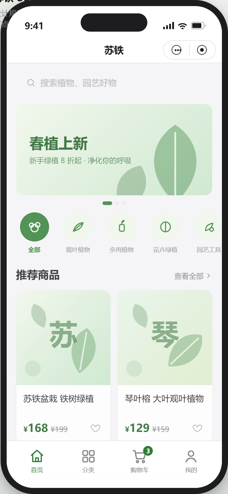
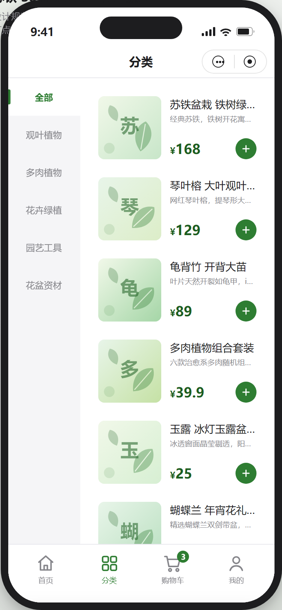
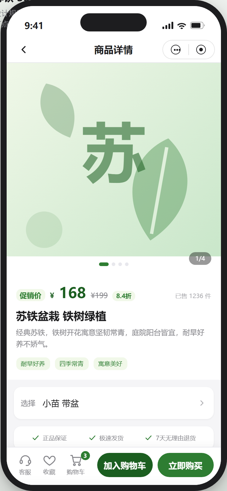
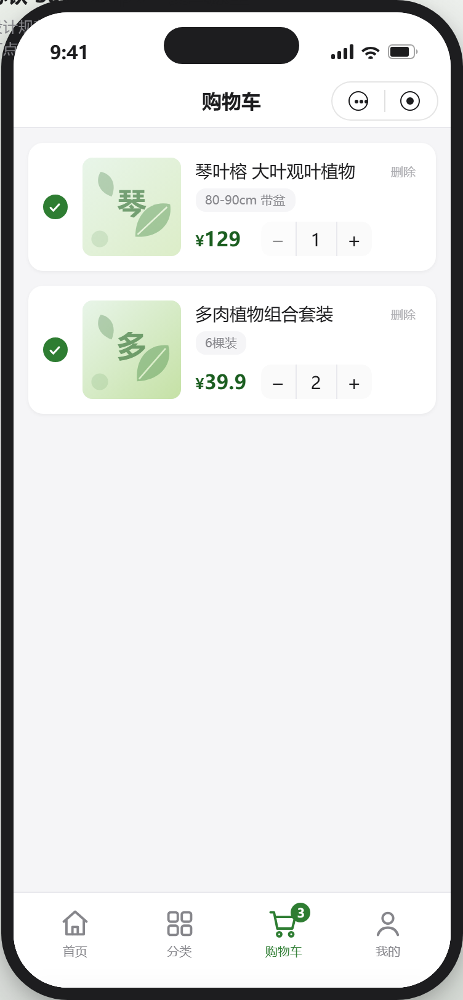
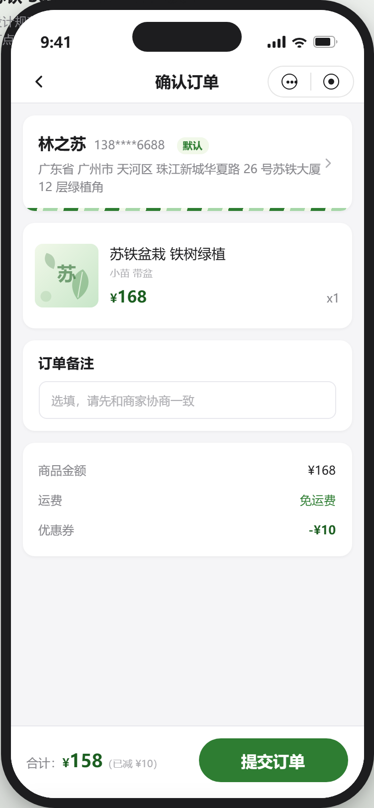
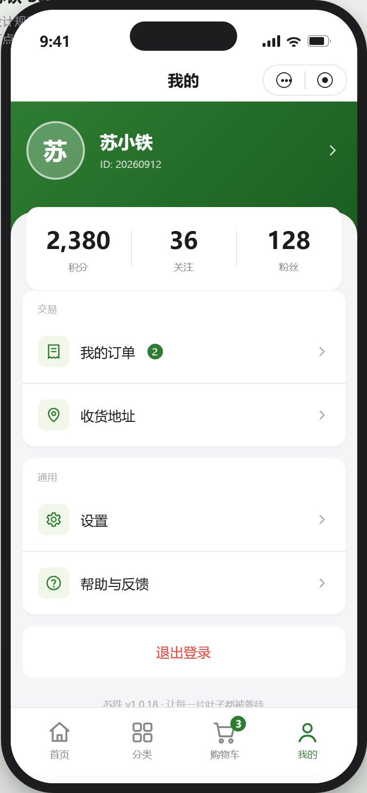
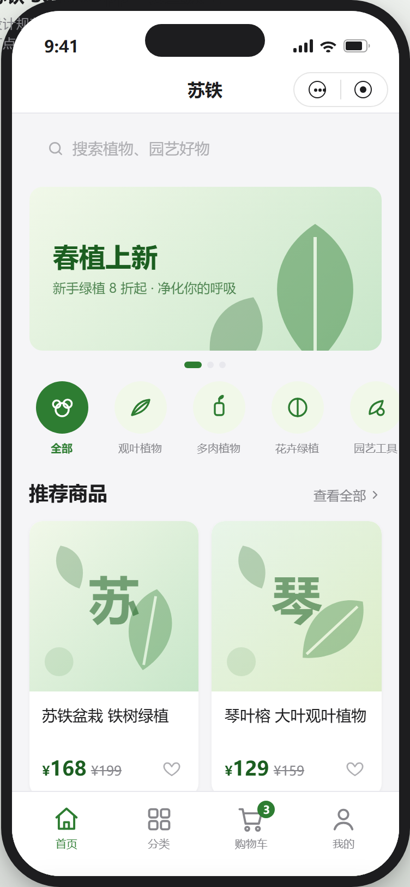
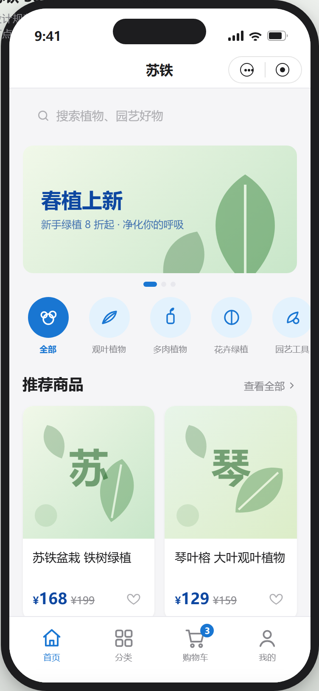
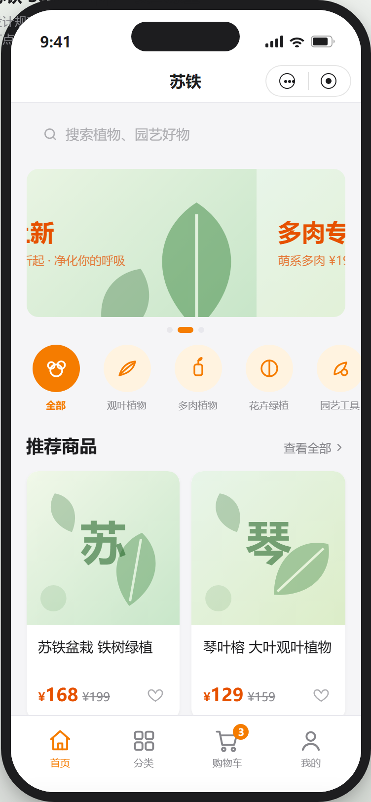

# SutWxApp - 苏铁微信小程序


## 简介

苏铁微信小程序以 **WordPress 网站为后端（headless CMS）**，在微信侧对网站内容进行「优化排版并显示」，提供文章/商品浏览、购物车、订单管理、用户中心等核心功能。界面设计采用 Apple 极简风格，提供优质的用户体验。

## 设计风格

### Apple 极简设计

采用 Apple 官网设计风格，核心特点：

- **极简主义**：减少视觉干扰，突出核心内容
- **大图展示**：商品图片采用大尺寸展示
- **充足留白**：使用合理的间距创造清爽感
- **清晰层次**：通过字体大小、颜色深浅建立视觉层级
- **微妙动效**：悬停效果、点击反馈、平滑过渡

### 颜色系统

| 颜色 | 用途 |
|------|------|
| #2E7D32 | 主色调（绿色） |
| #1B5E20 | 深绿色 |
| #F1F8E9 | 浅绿色背景 |
| #1D1D1F | 主要文字 |
| #86868B | 次要文字 |
| #F5F5F7 | 页面背景 |

## 界面预览（高保真原型）

下图来自核心高保真原型 `prototype/prototype.html`。原型统一存放于仓库根 `prototype/` 目录，浏览器直接打开即可交互。

### 核心页面

| 首页 | 分类 | 商品详情 |
|------|------|----------|
|  |  |  |

### 更多页面

| 购物车 | 订单确认 | 我的 |
|--------|----------|------|
|  |  |  |

### 主题换肤

主题由 WordPress 后台可配置，小程序自带多套默认配色预设。下方为同一首页在三种预设下的效果：

| 苏铁绿（默认） | 天空蓝 | 暖阳橙 |
|------|------|------|
|  |  |  |

## 快速开始

### 环境准备

1. **下载微信开发者工具**

   前往 [微信开发者工具官网](https://developers.weixin.qq.com/miniprogram/dev/devtools/download.html) 下载并安装适合你操作系统的版本。

2. **导入项目**

   - 打开微信开发者工具
   - 点击「导入项目」或「+」号
   - 选择项目目录：`SutWxApp/SutWxApp/`
   - 填写项目名称和 AppID（如果没有 AppID，可以选择「测试号」）
   - 点击「导入」或「确定」

3. **开始开发**

   项目导入后，你可以在微信开发者工具中：
   - 预览小程序效果
   - 修改代码实时预览
   - 使用真机调试功能

> 小程序为纯前端应用，后端为 **WordPress 网站**，内容经 REST API 提供（基地址见 `app.js` 的 `globalData.baseUrl`）。本地联调时将该地址指向 WordPress 站点或其 API 代理即可。

## 项目结构

```
SutWxApp/
├── app.js                  # 小程序入口（App 实例、生命周期、全局数据）
├── app.json                # 全局配置（路由、tabBar、窗口）
├── app.wxss                # 全局样式（Apple 风格 CSS 变量）
├── models/                 # 数据模型（商品 / 主题映射）
├── behaviors/              # 页面复用 Behavior（主题注入）
├── components/             # 自定义组件
│   ├── empty-state/        # 空状态组件
│   └── product-card/       # 商品卡片组件
├── images/                 # 图片资源
│   └── tabbar/             # tabBar 图标
├── locales/                # 多语言文件（.po / .pot）
├── pages/                  # 页面文件（每页含 .js/.wxml/.wxss/.json）
│   ├── home/               # 首页
│   ├── category/           # 分类页
│   ├── product/            # 商品详情页
│   ├── cart/               # 购物车
│   ├── order/              # 订单模块（列表/详情/确认）
│   ├── user/               # 用户中心
│   ├── address/            # 地址管理（分包）
│   ├── settings/           # 设置页（分包）
│   └── help/               # 帮助中心（分包）
├── services/               # 服务层（API 调用封装）
├── utils/                  # 工具类（请求/格式化/监控/状态/图片压缩）
├── scripts/                # 工程脚本（版本/配置校验、小程序预览与上传）
├── __tests__/              # Jest 单元测试
└── package.json            # 依赖与质量门禁脚本（CI 使用入口）
```

## 页面导航

| 页面 | 路径 | 说明 |
|------|------|------|
| 首页 | pages/home/index | 商品展示、分类导航、搜索 |
| 分类 | pages/category/index | 商品分类浏览 |
| 商品详情 | pages/product/index | 商品信息、规格、加购 |
| 购物车 | pages/cart/index | 购物车管理 |
| 订单列表 | pages/order/index | 我的订单 |
| 订单详情 | pages/order/detail | 订单明细、状态 |
| 订单确认 | pages/order/confirm | 下单结算 |
| 用户中心 | pages/user/index | 个人中心、设置入口 |
| 地址管理 | pages/address/index | 收货地址增删改查 |
| 设置 | pages/settings/index | 语言、版本等设置 |
| 帮助中心 | pages/help/index | 常见问题、反馈 |

## 核心功能

- 商品浏览、搜索与分类导航
- 商品详情与加购
- 购物车管理
- 订单创建、支付与状态跟踪
- 收货地址管理
- 用户中心与个人设置
- 多语言（中文 / 英文）
- 主题换肤：WordPress 后台可配置，内置多套默认配色预设（苏铁绿 / 天空蓝 / 暖阳橙 / 紫罗兰 / 石墨黑），全站动态生效
- 帮助中心与反馈

## 技术栈

- **框架**：微信小程序原生框架（WXML / WXSS / JS）
- **开发语言**：JavaScript（ES6+）
- **UI 风格**：Apple 极简设计（全局 CSS 变量设计系统）
- **状态管理**：`utils/store.js` + 本地存储
- **网络请求**：`wx.request` + `utils/request.js`（拦截器 / 重试 / LRU 缓存 / 取消 / 并发队列）
- **多语言**：gettext 风格 `.po` / `.pot`
- **开发工具**：微信开发者工具、VS Code
- **后端**：WordPress 网站（headless CMS），内容经 REST API（`/api/*`）提供
- **质量门禁**：ESLint + Jest（GitHub Actions 自动执行）
- **交付**：GitHub Actions + `miniprogram-ci`（预览 / 上传体验版）

## 持续集成与交付（CI/CD）

项目基于 GitHub Actions 建立质量门禁与交付流水线，工作流位于 `.github/workflows/`：

| 工作流 | 触发方式 | 作用 |
|--------|----------|------|
| `ci.yml` | push（main / dev / feature / fix / hotfix）、PR、手动 | ESLint 检查、Jest 单元测试（覆盖率归档）、版本号与小程序配置校验 |
| `release.yml` | 推送 `v*.*.*` Tag（或手动补发） | 校验 Tag 与版本号一致，并抽取 `CHANGELOG.md` 对应小节创建 GitHub Release |
| `miniprogram-deploy.yml` | 手动触发 | 经 `miniprogram-ci` 生成预览二维码或上传体验版 |

### 本地质量门禁

```bash
cd SutWxApp
npm ci                # 安装依赖
npm run lint          # ESLint 检查
npm test              # 单元测试
npm run check         # 版本号一致性 + 小程序配置完整性校验
npm run ci            # 等价于 CI 全流程：lint + check + test
```

### 上传小程序（CD）

上传依赖微信公众平台「开发管理 > 开发设置 > 小程序代码上传」生成的密钥，需在仓库 Secrets 中配置：

| Secret | 说明 |
|--------|------|
| `MINIPROGRAM_PRIVATE_KEY` | 上传密钥文件内容（必填） |
| `MINIPROGRAM_APPID` | 小程序 AppID（`project.config.json` 仍为占位值 `touristappid` 时必填） |

配置完成后在 Actions 中手动运行 `Deploy MiniProgram` 工作流，选择 `preview`（生成预览二维码）或 `upload`（上传体验版）。私钥文件不会入库，由工作流在运行期临时写入并在结束后删除。

### 发布流程

1. 同步版本号：`SutWxApp/package.json`、`SutWxApp/app.js` 的 `globalData.version`、README 版本徽章、`CHANGELOG.md` 新版本小节
2. 本地执行 `npm run ci` 自检通过
3. 提交并推送后打 Tag：`git tag v3.0.8 && git push origin v3.0.8`
4. Tag 触发 `release.yml` 自动创建 GitHub Release
5. 在 Actions 中运行部署工作流上传体验版，再到微信公众平台提交审核

## 相关文档

- [项目规范总览](openspec/README.md)
- [需求与规格（openspec/specs）](openspec/specs/)
  - [项目规范](openspec/specs/project/spec.md)
  - [架构规范](openspec/specs/architecture/spec.md)
  - [数据规范](openspec/specs/data/spec.md)
  - [开发规范](openspec/specs/development/spec.md)
  - [设计规范](openspec/specs/design/spec.md)
  - [运维与发布规范](openspec/specs/ops/spec.md)
  - [测试规范](openspec/specs/testing/spec.md)
- [原型目录（prototype/）](prototype/README.md)
  - [核心 6 页高保真原型](prototype/prototype.html)：首页 / 分类 / 商品详情 / 购物车 / 订单确认 / 我的
  - [扩展 5 页原型](prototype/prototype-extra.html)：订单列表 / 订单详情 / 地址管理 / 设置 / 帮助中心
  - [组件库规范](prototype/wireframes.html)：基础 / 复合 / 业务组件与使用规则
- [项目概览](docs/PROJECT_OVERVIEW.md)
- [技术栈报告](openspec/TECH_STACK_REPORT.md)
- [改进报告](openspec/IMPROVEMENTS_REPORT.md)
- [WordPress 对接参考实现（微慕 Minapper/Watch-Life）](https://github.com/iamxjb/winxin-app-watch-life.net)

## 版本历史

详细变更请查看 [CHANGELOG.md](CHANGELOG.md)

## 许可证

MIT License
