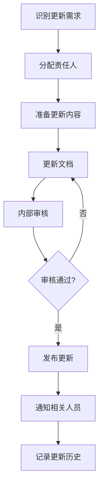

/**
 * 文件名: 02-文档维护.md
 * 版本号: 1.0.0
 * 更新日期: 2025-11-23
 * 描述: 02-文档维护 文档文件
 */
# 文档维护

**版本号：1.0.16**
*最后更新时间：2024年11月1日*

## 1. 概述

### 1.1 维护目的

本文档旨在规范SutWxApp项目文档的维护流程和标准，确保项目文档的及时性、准确性和有效性，使文档能够持续为项目开发、测试、部署和运维提供可靠的支持。

### 1.2 维护范围

本维护规范适用于项目中的所有正式文档，包括但不限于：
- 技术文档（架构设计、API文档等）
- 操作文档（用户指南、管理员手册等）
- 开发文档（开发规范、代码说明等）
- 项目管理文档（计划、进度报告等）

### 1.3 维护原则

- **及时性**：文档应及时更新，与项目进展保持同步
- **准确性**：确保文档内容准确反映当前系统状态和功能
- **一致性**：维护文档间的一致性，避免相互矛盾
- **完整性**：确保文档内容完整，不遗漏重要信息
- **可追溯性**：记录所有文档变更，便于追溯历史版本

## 2. 文档维护组织与职责

### 2.1 维护组织结构

| 角色 | 职责描述 | 人员要求 |
|-----|---------|--------|
| 文档维护主管 | 负责文档维护的整体规划和协调 | 具有项目管理经验，熟悉文档管理流程 |
| 文档管理员 | 负责日常文档维护工作，包括更新、归档等 | 熟悉文档管理工具，细致认真 |
| 技术内容审核人 | 审核技术文档的准确性和专业性 | 具有相关技术领域的专业知识 |
| 语言内容审核人 | 审核文档的语言表达和格式规范 | 具有良好的语言表达能力和编辑经验 |
| 文档编写人 | 根据需要更新和完善文档内容 | 了解所负责领域的技术和业务知识 |

### 2.2 文档责任人制度

- **责任分配**：每个文档必须指定一名主要责任人和一名备份责任人
- **职责定义**：明确每个文档责任人的具体职责和工作范围
- **变更通知**：文档责任人变更时，必须及时通知相关人员
- **责任追溯**：对文档质量问题，可追溯到相关责任人

## 3. 文档更新流程

### 3.1 更新触发机制

文档更新可由以下情况触发：

1. **功能变更**：当系统功能发生变更时，相关文档必须更新
2. **架构调整**：当系统架构或技术方案调整时，相关文档必须更新
3. **发现错误**：当发现文档中存在错误或不准确信息时，必须及时修正
4. **用户反馈**：当收到用户对文档的改进建议时，应评估并适当采纳
5. **定期审查**：按照计划定期审查文档，确保内容不过时

### 3.2 更新流程步骤



1. **识别更新需求**：明确需要更新的文档和具体内容
2. **分配责任人**：指定文档更新的责任人和完成时间
3. **准备更新内容**：收集相关信息，准备更新材料
4. **更新文档**：按照规范更新文档内容，确保格式正确
5. **内部审核**：由文档责任人进行自我审核
6. **专业审核**：由技术审核人和语言审核人分别进行审核
7. **修改完善**：根据审核意见进行修改和完善
8. **发布更新**：将更新后的文档发布到指定位置
9. **通知相关人员**：通知可能受影响的相关人员
10. **记录更新历史**：更新版本历史记录

### 3.3 更新优先级

根据更新内容的重要性，将文档更新分为三个优先级：

| 优先级 | 描述 | 处理时限 |
|-------|------|--------|
| 高 | 影响系统安全或用户体验的关键错误 | 24小时内 |
| 中 | 影响功能理解但不影响使用的错误 | 3个工作日内 |
| 低 | 格式、拼写等非关键问题 | 1个工作周内 |

## 4. 文档审查机制

### 4.1 审查类型

#### 4.1.1 技术审查

- **审查内容**：技术准确性、完整性、一致性
- **审查人员**：技术内容审核人或领域专家
- **审查频率**：每次更新后必须进行技术审查

#### 4.1.2 语言审查

- **审查内容**：语言表达、格式规范、可读性
- **审查人员**：语言内容审核人
- **审查频率**：每次更新后必须进行语言审查

#### 4.1.3 定期审查

- **审查内容**：文档的整体质量和时效性
- **审查人员**：文档维护主管和相关责任人
- **审查频率**：
  - 核心技术文档：每月审查一次
  - 用户操作文档：每季度审查一次
  - 其他文档：每半年审查一次

### 4.2 审查流程

1. **审查准备**：准备审查文档和相关资料
2. **实施审查**：按照审查标准进行详细审查
3. **记录问题**：记录发现的问题和改进建议
4. **反馈意见**：向文档责任人反馈审查意见
5. **跟踪整改**：跟踪问题整改情况
6. **确认完成**：确认所有问题已得到解决

### 4.3 审查标准

| 审查项目 | 合格标准 | 检查方法 |
|---------|---------|--------|
| 准确性 | 技术信息准确无误，与实际系统一致 | 与代码、配置、功能进行对比验证 |
| 完整性 | 包含所有必要信息，无明显遗漏 | 检查是否包含完整的流程、参数、示例等 |
| 一致性 | 术语、命名、格式保持一致 | 检查文档内部及与其他文档的一致性 |
| 清晰性 | 表达清晰，易于理解 | 阅读测试，检查是否容易理解 |
| 规范性 | 符合文档格式和风格规范 | 对照《文档格式规范》<mcfile name="00-文档格式规范.md" path="docs\01-文档指南\00-文档格式规范.md"></mcfile>检查 |

## 5. 版本管理

### 5.1 版本号规则

遵循语义化版本规范（SemVer），版本号格式为：MAJOR.MINOR.PATCH

- **MAJOR**（主版本号）：不兼容的破坏性变更，文档结构或核心内容发生重大变化
- **MINOR**（次版本号）：向下兼容的新功能，添加新内容或扩展现有内容
- **PATCH**（修订号）：向下兼容的问题修复，修正错误或优化表达

### 5.2 版本标记

- **版本号位置**：文档标题下方必须标注当前版本号和更新时间
- **版本一致性**：文档版本应与相关代码或功能版本保持一致
- **更新标记**：使用修订标记（如修订线、高亮等）标识更新内容

### 5.3 版本历史记录

每个文档必须包含版本历史记录，格式如下：

```markdown
| 版本号 | 更新日期 | 更新内容摘要 | 更新人 | 审核人 |
|-------|---------|------------|-------|-------|
| 1.0.0 | 2024-01-15 | 初始版本 | 张三 | 李四 |
| 1.0.1 | 2024-02-10 | 修正功能描述错误 | 王五 | 赵六 |
| 1.1.0 | 2024-03-20 | 添加新功能说明 | 张三 | 李四 |
```

### 5.4 版本归档

- **归档条件**：
  - 版本不再使用
  - 主版本号发生变更
  - 文档内容有重大调整
- **归档位置**：归档版本存储在`docs/11-归档资料/版本归档/`目录下
- **归档命名**：使用`文档名_版本号_日期`格式命名，如`开发规范_1.0.5_20240501.md`

## 6. 文档存储与检索

### 6.1 存储结构

遵循项目文档目录结构，按照文档类型分类存储：

```
docs/
├── 01-文档指南/    # 文档规范和指南
├── 02-项目概览/    # 项目概述文档
├── 03-管理员指南/  # 管理员相关文档
├── 04-开发者指南/  # 开发者相关文档
├── 05-用户指南/    # 用户操作文档
├── 06-功能模块/    # 功能模块详细说明
├── 07-常见问题/    # FAQ文档
├── 08-测试文档/    # 测试相关文档
├── 09-TODO计划/    # 待办事项和计划
├── 10-运维与部署/  # 运维和部署文档
├── 11-归档资料/    # 归档文档
└── 12-优化建议/    # 优化建议文档
```

### 6.2 文档命名

- **命名格式**：使用`XX-文档名称.md`格式
- **版本标识**：主文档不包含版本号，通过Git版本控制
- **多语言标识**：英文文档添加`-en_US`后缀

### 6.3 检索方法

- **文件浏览**：通过目录结构浏览查找
- **关键词搜索**：使用Git或文档工具的搜索功能
- **索引查询**：参考《索引与检索系统》<mcfile name="07-索引与检索系统.md" path="docs\01-文档指南\07-索引与检索系统.md"></mcfile>

## 7. 文档废弃与归档

### 7.1 文档废弃

当文档满足以下任一条件时，可考虑废弃：

- 文档内容已完全过时，不再适用
- 文档描述的功能已被移除或替换
- 有新版本文档完全替代了旧文档
- 项目结构或技术栈发生重大变更，使文档失去参考价值

### 7.2 废弃流程

1. **废弃评估**：评估文档是否符合废弃条件
2. **审批流程**：提交文档废弃申请，经文档维护主管批准
3. **废弃标记**：在文档开头添加废弃标记，注明替代文档
4. **归档处理**：将废弃文档移至归档目录
5. **通知相关人员**：通知可能受影响的相关人员

### 7.3 归档管理

- **归档目录**：废弃文档存储在`docs/11-归档资料/废弃文档/`目录下
- **归档命名**：使用`废弃_文档名_废弃日期.md`格式
- **归档索引**：维护归档文档索引，记录废弃原因和替代文档
- **归档期限**：归档文档保留至少2年，之后可考虑删除

## 8. 维护工具与技术

### 8.1 推荐工具

| 工具类型 | 推荐工具 | 用途 |
|---------|---------|------|
| 版本控制 | Git | 文档版本管理和变更追踪 |
| 编辑工具 | VSCode、Typora | Markdown文档编辑 |
| 协作平台 | GitHub、GitLab | 文档协作和审核 |
| 图表工具 | Draw.io、Mermaid | 绘制文档中的图表 |
| 审核工具 | Grammarly、Hemingway | 语言和写作风格检查 |

### 8.2 自动化工具

- **文档检查脚本**：自动检查文档格式和链接有效性
- **变更通知工具**：文档更新后自动通知相关人员
- **版本同步工具**：确保文档版本与代码版本同步
- **过期检测工具**：自动检测长时间未更新的文档

## 9. 维护绩效考核

### 9.1 考核指标

| 指标类型 | 具体指标 | 权重 |
|---------|---------|------|
| 时效性 | 文档更新及时率、响应时间 | 30% |
| 准确性 | 文档错误率、问题修复率 | 25% |
| 完整性 | 文档覆盖率、信息完整度 | 20% |
| 质量 | 审核通过率、用户满意度 | 15% |
| 流程合规性 | 流程遵循度、记录完整性 | 10% |

### 9.2 考核周期

- **日常考核**：每次文档更新后进行
- **月度考核**：每月对文档维护工作进行综合评估
- **年度考核**：年度文档维护工作的全面评估

### 9.3 激励机制

- **表彰奖励**：对文档维护工作表现优秀的人员进行表彰
- **经验分享**：组织优秀文档维护经验分享
- **培训提升**：为文档维护人员提供专业培训

## 10. 常见问题处理

### 10.1 文档与实际不符

**原因**：系统更新后文档未及时更新
**解决方法**：
1. 立即安排文档责任人更新文档
2. 评估问题影响范围，确定优先级
3. 更新完成后进行全面审查
4. 分析原因，避免类似问题再次发生

### 10.2 文档质量问题

**原因**：审查不严格、编写不规范
**解决方法**：
1. 对存在问题的文档进行修订
2. 加强文档审查流程
3. 对文档编写人员进行培训
4. 更新文档模板和规范

### 10.3 文档更新不及时

**原因**：责任人不明确、流程不完善
**解决方法**：
1. 明确文档更新责任人
2. 优化文档更新流程
3. 设置提醒机制
4. 加强监督和考核

## 11. 附录

### 11.1 文档维护相关表格

#### 11.1.1 文档更新申请表

| 申请信息 | 内容 |
|---------|------|
| 文档名称 | [文档名称] |
| 当前版本 | [当前版本号] |
| 更新原因 | [详细说明更新原因] |
| 更新内容 | [列出主要更新内容] |
| 预计完成时间 | [日期] |
| 申请人 | [姓名] |
| 申请日期 | [日期] |
| 审批意见 | [审批人签名及日期] |

#### 11.1.2 文档审查记录表

| 审查信息 | 内容 |
|---------|------|
| 文档名称 | [文档名称] |
| 版本号 | [版本号] |
| 审查人 | [姓名] |
| 审查日期 | [日期] |
| 发现问题 | [列出发现的问题] |
| 改进建议 | [提供改进建议] |
| 审查结论 | [通过/需修改/不通过] |

### 11.2 文档维护模板

#### 11.2.1 版本历史记录模板

```markdown
## 版本历史

| 版本号 | 更新日期 | 更新内容摘要 | 更新人 | 审核人 |
|-------|---------|------------|-------|-------|
| [版本号] | [日期] | [内容摘要] | [姓名] | [姓名] |
```

#### 11.2.2 文档废弃标记模板

```markdown
> ⚠️ **文档已废弃**
> 本文档已于 [日期] 废弃，不再提供支持。
> 请参考新文档：[新文档名称及链接]
> 废弃原因：[简要说明废弃原因]
```

---

**版本号：1.0.16**
*最后更新时间：2024年11月1日*
